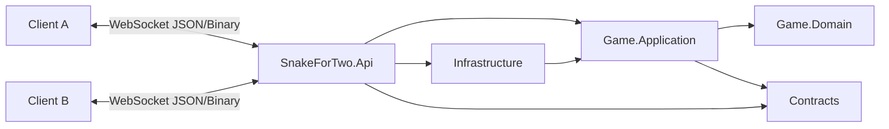
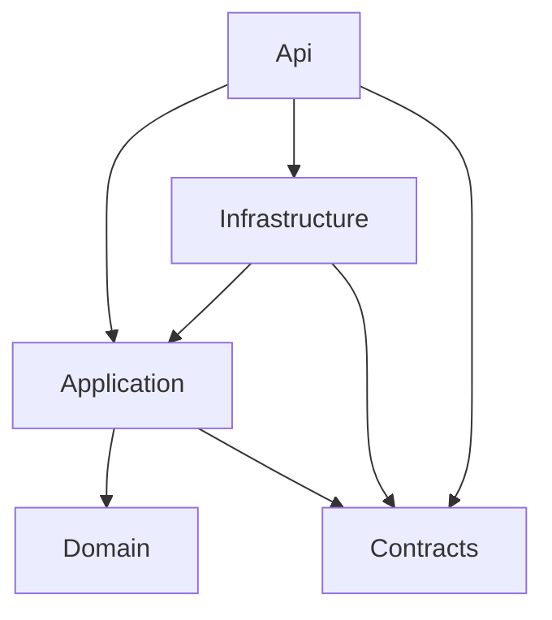

# SnakeForTwo Backend Architecture

Status: Draft with initial product decisions captured

Target runtime: .NET 10 / ASP.NET Core

## 1. Architecture Goals

SnakeForTwo is a small, real-time, two-player Snake backend. The server is responsible for matchmaking, room lifecycle, authoritative game simulation, and rollback-aware input processing. The client is responsible for immediate local rendering, opponent prediction, and visual correction when server authority disagrees with the prediction.

The architecture should stay intentionally modest. Lite-DDD is used only to keep deterministic game logic separate from WebSocket transport, room orchestration, persistence, and future infrastructure concerns.

Primary goals:

- Keep the game engine deterministic and testable without networking.
- Keep WebSocket protocol code outside the game engine.
- Support late inputs through rollback and re-simulation.
- Support same-tick input buffering for fast turn sequences.
- Keep the first version single-process and in-memory, while avoiding choices that would block future multi-server ownership per room.
- Exclude Kafka from the POC architecture. Future event streaming can be added later for analytics/replay, but it is not part of the current design.

## 2. High-Level Shape



Project layout:

- `SnakeForTwo.Api`: ASP.NET Core entrypoint, WebSocket accept loop, connection sessions, authentication/room token checks, message serialization.
- `SnakeForTwo.Contracts`: transport DTOs shared between API and tests/clients where useful.
- `SnakeForTwo.Game.Domain`: deterministic engine, rules, value objects, rollback snapshot model, input scheduling rules.
- `SnakeForTwo.Game.Application`: use cases and orchestration: rooms, ready flow, match loop, rollback coordinator, ports.
- `SnakeForTwo.Infrastructure`: in-memory repositories, room registry, and lightweight runtime adapters.
- `SnakeForTwo.Game.Domain.Tests`: fast tests for engine, input buffering, deterministic simulation.
- `SnakeForTwo.Game.Application.Tests`: fake-clock tests for room lifecycle, delayed input, rollback coordinator behavior.

Dependency direction:



`Domain` must not depend on ASP.NET, WebSockets, brokers, timers, random system clocks, or serialization concerns.

## 3. Runtime Model

The first production shape should be a single ASP.NET Core process:

- One authoritative match loop per active game.
- In-memory room registry.
- In-memory match state, snapshots, and input history.
- WebSockets for low-latency bidirectional messages.
- No Kafka or external broker in the current POC.

This is enough for an early two-player game. Horizontal scaling adds complexity because each match needs single-writer authority. If scale is needed later, assign each room/match to one node using sticky routing or a room directory. Do not distribute a single match loop across nodes.

## 4. Bounded Contexts

### Lobby / Room Context

Responsibilities:

- Create a room and return `roomId`.
- Join an existing room by `roomId`.
- Track connected players.
- Track ready state.
- Start match when both players are ready.
- Return players to room after game over.
- Handle leave/disconnect policy.

Core concepts:

- `Room`
- `RoomId`
- `PlayerSessionToken`
- `PlayerSeat` or `PlayerSlot`
- `ReadyState`
- `RoomStatus`: `WaitingForPlayers`, `ReadyCheck`, `Starting`, `InGame`, `PostGame`

### Gameplay Context

Responsibilities:

- Fixed-tick deterministic simulation.
- Input buffering.
- Late input insertion.
- Rollback and re-simulation.
- Collision/game-over resolution.
- Food spawning with deterministic seed.
- Snapshot/history retention.

Core concepts:

- `GameSession`
- `GameState`
- `GameTick`
- `PlayerId`
- `Snake`
- `Cell`
- `Direction`
- `InputCommand`
- `InputTimeline`
- `GameSnapshot`
- `RollbackWindow`

## 5. WebSocket Protocol

Use ASP.NET Core raw WebSockets initially. Microsoft recommends SignalR for many real-time apps because it simplifies common app patterns and fallback transports, but this game benefits from a compact, explicit, deterministic message protocol. SignalR can be revisited if browser/client ergonomics matter more than protocol control.

Suggested endpoint:

- `GET /ws`

Client messages:

- `createRoom`
- `joinRoom`
- `resumeRoom`
- `ready`
- `unready`
- `input`
- `leaveRoom`
- `ping`

Client messages are allowed to have different payload shapes depending on message type. The first gameplay input payload should include direction and client time:

```json
{
  "type": "input",
  "direction": "Left",
  "clientTime": 1234567890,
  "clientSequence": 7
}
```

`clientSequence` is assigned by the sending client and echoed in `turnIntentAccepted` so the sender can replace a local optimistic turn with the server-accepted effective tick.

Room messages use their own payloads:

```json
{ "type": "createRoom" }
```

```json
{ "type": "joinRoom", "roomId": "ABC123" }
```

```json
{ "type": "resumeRoom", "roomId": "ABC123", "playerSessionToken": "..." }
```

The server adds trusted metadata from the connection:

- `playerId`
- `roomId`
- `serverReceivedAt`
- `receivedOrder`
- estimated client clock offset

Server messages:

- `roomCreated`: room id, player assignment, and player session token.
- `roomJoined`: current room state, player assignment, and player session token.
- `roomResumed`: current room state after reclaiming an existing player seat, plus the current player session token.
- `roomState`: players, ready flags, room status.
- `gameStarting`: countdown, start server time, timing settings, deterministic seed.
- `gameStarted`: assigned player id/seat and initial state.
- `turnIntentAccepted`: server-validated input intent, broadcast immediately so clients can render a future turn before the next full frame arrives.
- `authoritativeFrame`: full authoritative board state for the current tile tick, server time, and state hash.
- `correction`: full authoritative state for a previous/current tick when rollback changes already-broadcast history.
- `gameFinished`: result and final state.
- `error`: validation or room lifecycle errors.
- `pong`: time sync support.

The authoritative gameplay payload should be object-oriented rather than a 2D encoded cell array, because that gives the client enough structure for local prediction and visual correction:

```json
{
  "type": "authoritativeFrame",
  "roomId": "abracadabra",
  "matchId": "match-1",
  "tick": 42,
  "serverTime": 1234567890,
  "stateHash": "abc123",
  "state": {
    "board": { "width": 32, "height": 24 },
    "snakes": [
      {
        "playerId": "player-a",
        "alive": true,
        "head": { "x": 10, "y": 6 },
        "direction": "Right",
        "body": [{ "x": 10, "y": 6 }, { "x": 9, "y": 6 }]
      }
    ],
    "food": [{ "ownerPlayerId": "player-a", "cell": { "x": 14, "y": 6 } }],
    "status": "Running"
  }
}
```

The important semantic detail is that `head` and `direction` describe where the snake moves from for this tile tick, not a destination cell. For a frame at tick `T`, `direction` is the outgoing direction used for movement from tick `T` to tick `T + 1`.

When the server accepts a player input, it broadcasts the accepted turn intent immediately:

```json
{
  "type": "turnIntentAccepted",
  "roomId": "abracadabra",
  "matchId": "match-1",
  "playerId": "player-a",
  "direction": "Up",
  "effectiveTick": 42,
  "clientTime": 1234567890,
  "clientSequence": 7,
  "serverReceivedAt": 1234567990
}
```

`effectiveTick: 42` means the accepted direction applies to movement from tick `42` to tick `43`. This message is an early render hint and acknowledgement, not a replacement for the next authoritative frame.

For early development, JSON is easier. For production polish, a compact binary encoding can reduce payload size, but the architecture should not depend on it.

## 6. Time, Ticks, Animation Frames, And Client Time

The server runs the match at a fixed tile tick rate. One server game tick always means one tile movement. Initial configurable timing:

- Movement speed: 2 tiles per second.
- Server tick rate: 2 ticks per second.
- Server tick duration: 500 milliseconds.
- Animation frames per tile: 5 visual frames, client-rendered and configurable.
- Rollback history: 3 to 5 seconds.
- Input future buffer: 2 to 4 tile ticks.

The snake advances one tile every server tick. `AnimationFramesPerTile` is presentation timing metadata sent to clients so they can render the movement between tile ticks in consistent sub-steps. It does not create additional authoritative simulation ticks on the server.

Inputs are mapped to tile ticks. If a player is visually between `(1,0)` and `(2,0)` moving right and presses up, the input is scheduled for the next legal tile boundary, so the snake reaches `(2,0)` and then moves to `(2,1)`.

Because the client sends `clientTime`, the server needs clock calibration:

1. During WebSocket connection and before match start, exchange ping/pong samples.
2. Estimate client-to-server clock offset and jitter.
3. On each input, convert `clientTime` to estimated server time.
4. Convert estimated server time to target game tick using the match start time and tick duration.

`clientInputSequence` can be added later for duplicate detection and rollback debugging, but the first contract does not require authoritative frames to acknowledge individual inputs.

## 7. Runtime Configuration

Initial configuration values:

```json
{
  "Game": {
    "TilesPerSecond": 2,
    "AnimationFramesPerTile": 5,
    "RollbackHistorySeconds": 5,
    "InputFutureBufferTicks": 4,
    "DisconnectGracePeriodSeconds": 10
  }
}
```

The runtime should derive:

- `TicksPerSecond = TilesPerSecond`
- `TickDuration = 1 / TicksPerSecond`
- `AnimationFrameDuration = TickDuration / AnimationFramesPerTile`

## 8. Input Buffering

Each player has an input timeline. The engine consumes at most one accepted direction per player per tick.

Buffering rule:

1. Convert incoming input to `targetTick`.
2. Clamp target tick to the rollback window. Too-old inputs are rejected or treated as telemetry.
3. Insert the direction at the earliest tick greater than or equal to `targetTick` where it can be legally applied.
4. A direction is legal if it is not a direct 180-degree reversal from the previously scheduled/applied direction.
5. If two inputs arrive for the same tick, the first legal one applies at that tick and later legal inputs are carried to following ticks.
6. Broadcast `turnIntentAccepted` as soon as the input is accepted, using the inserted tick as `effectiveTick`.

Example:

- Current direction before tick 42: `Up`
- Same tick inputs arrive in order: `Left`, then `Down`
- Tick 42 applies `Left`
- Tick 43 applies `Down`

This matches the likely player intent: they performed a rapid turn sequence to reverse direction without directly turning from `Up` to `Down`.

Important limits:

- Maximum queued inputs per player, for example 4.
- Drop duplicate consecutive directions.
- Reject direct reversals that cannot become legal within the queue window.
- Preserve per-player WebSocket order.

## 9. Rollback Netcode On The Server

The server is authoritative, but accepts that a valid input can arrive after the server has already simulated the tick where that input belongs.

State retained per active match:

- `currentTick`
- canonical `GameState`
- `GameSnapshot` ring buffer, indexed by tick
- per-player `InputTimeline`
- committed authoritative frames or state hashes
- deterministic RNG seed and food spawn stream

Normal tile tick:

1. Read scheduled input for each player for `currentTick`.
2. Apply exactly one direction per player.
3. Advance deterministic engine one tile tick.
4. Store snapshot/state hash.
5. Broadcast a full authoritative frame.

Late input:

1. Input arrives and maps to `targetTick < currentTick`.
2. Insert it into the canonical input timeline.
3. If the insertion changes any input from `targetTick` onward, load the snapshot immediately before the earliest changed tick.
4. Re-simulate from that tick through `currentTick`.
5. Compare state hashes before and after re-simulation.
6. Broadcast correction frames with full authoritative state if authoritative state changed.

Rollback policy:

- Maximum rollback depth should be bounded, for example 6 to 10 tile ticks for a 3 to 5 second rollback window at 2 tiles per second.
- Inputs older than the rollback window are rejected and acknowledged as stale.
- Rollback must run on the match's single-threaded game loop, not concurrently with tick simulation.
- During re-simulation, no wall clock, random system calls, or network calls may be used.

## 10. Determinism Rules

The domain engine must be pure from the perspective of a tick:

```csharp
GameState Advance(GameState state, TickInputs inputs, GameRules rules);
```

Rules:

- Use integer grid coordinates.
- Use a math-style coordinate system for canonical game state: `X` increases right and `Y` increases upward. Renderers whose native coordinates increase downward, such as HTML canvas, should invert `Y` at the drawing boundary.
- Use deterministic iteration order.
- Use deterministic seeded RNG or precomputed food positions.
- Do not read current time inside the domain.
- Do not use unordered collections when iteration affects results.
- Snapshot by value or deep copy. No shared mutable snake bodies between snapshots.
- Walls wrap around the board.
- This is a co-op game: any player loss means the whole team loses.
- No PvP tie-breakers are needed. If either snake collides with self, teammate, or an invalid occupied cell, the game is lost.
- Food belongs to a specific player. The authoritative state should include `ownerPlayerId` for each food item.
- Food spawn cannot appear inside any snake body.

## 11. Game Loop Ownership

Each active match should be owned by one `MatchRunner`.

`MatchRunner` responsibilities:

- Own the fixed tick loop.
- Serialize all match commands through a mailbox/channel.
- Apply room commands only when valid for current state.
- Send output events to WebSocket sessions through an application port.

Recommended implementation:

- `BackgroundService` hosts a room/match coordinator.
- Each running match has a bounded `Channel<MatchCommand>`.
- WebSocket receive loop parses client messages and submits commands.
- WebSocket send loop writes queued server messages to the socket.
- The match loop never writes directly to a WebSocket.

This keeps socket lifetime and game simulation separated.

## 12. Matchmaking And Room Lifecycle

Create room:

1. Player connects.
2. Client sends `createRoom`.
3. Server creates a short unguessable room id, for example a roughly 12-symbol code such as `abracadabra`.
4. Player is assigned seat 1.
5. Server creates an unguessable `playerSessionToken` bound to the room and player seat.
6. Server replies `roomCreated`.
7. Client can display a join URL such as `/join?id=abracadabra`.

Join room:

1. Player connects.
2. Client sends `joinRoom` with `roomId`.
3. Server validates room exists and has available seat.
4. Player is assigned seat 2.
5. Server creates an unguessable `playerSessionToken` bound to the room and player seat.
6. Server broadcasts updated `roomState`.

Resume room:

1. Player reconnects after refresh or network drop.
2. Client sends `resumeRoom` with `roomId` and `playerSessionToken`.
3. Server validates that the token belongs to that room and an existing player seat.
4. Server attaches the new WebSocket session to the existing player id/seat.
5. Server sends `roomResumed` with the current or rotated `playerSessionToken` and broadcasts updated `roomState`.

Ready/start:

1. Each player sends `ready`.
2. When both players are ready, server transitions to `Starting`.
3. Server sends `gameStarting` with start time, seed, and timing settings.
4. At start time, server creates `GameSession` and transitions to `InGame`.

Game over:

1. Engine detects finish condition.
2. Server broadcasts `gameFinished`.
3. Room transitions to `PostGame` or `ReadyCheck`.
4. Ready flags reset.
5. Players can ready again for a rematch.

Disconnect policy:

- During lobby: disconnected player is marked disconnected and their seat is retained for reconnect until explicit leave or room expiry.
- During game: disconnected player can reclaim the same seat by reconnecting within a 10 second grace period; otherwise they forfeit.
- During postgame: disconnected player is marked disconnected and their seat is retained for reconnect until explicit leave or room expiry.
- A refreshed browser tab should reclaim the same player seat using `playerSessionToken`; the room id alone is not enough to impersonate an occupied seat.

## 13. Current Infrastructure Decision

Kafka is intentionally excluded from the POC.

Reasons:

- Gameplay requires low latency and a single authoritative match loop.
- Kafka adds broker roundtrips and operational complexity.
- Rollback needs immediate access to snapshots and input timelines.
- Kafka ordering is partition-based; it does not simplify per-match in-memory ordering.

Current infrastructure should be:

- In-memory room registry.
- In-memory match state and rollback history.
- Logging/metrics through normal ASP.NET Core observability.
- No external broker required to run the game.

Future event streaming can be revisited for analytics, replay, or leaderboards. If Kafka is added later, it should remain outside the hot gameplay path and use `matchId` as the topic key so all events for one match stay ordered within one partition.

## 14. Testing Strategy

Use TDD heavily for the domain engine and rollback coordinator.

Domain tests:

- Snake advances one cell every server tile tick.
- Direction changes apply on the correct tick.
- Direct 180-degree input is rejected.
- Same-tick `Left` then `Down` while moving `Up` is buffered over two ticks.
- Food spawn is deterministic for a seed.
- Food records the owning player id.
- Wall wrapping is deterministic.
- Self collision and snake-to-snake collision cause a co-op loss.
- Snapshot restore creates independent state.

Rollback tests:

- Late input for an already-simulated tick changes timeline and re-simulates.
- Late input that does not change canonical inputs does not trigger correction.
- Inputs older than rollback window are rejected.
- Re-simulation from same snapshot and inputs produces same state hash.
- Multiple late inputs are applied in deterministic order.

Application tests:

- Create room returns room id.
- Create room returns a player session token for seat reclaim.
- Join room assigns second seat.
- Resume room with a valid player session token reclaims the same player id and seat.
- Resume room with only a room id is rejected for occupied seats.
- Game starts only when both players are ready.
- Game finish returns players to room.
- Simulated network delay maps client time to earlier tick.
- Fake clock can advance match loop without real sleeps.
- Runtime timing derives a 500 millisecond tile tick from 2 tiles per second and a 100 millisecond visual frame duration from 5 animation frames per tile.

Integration tests later:

- WebSocket happy path: create, join, ready, input, receive authoritative frames.
- Invalid room id.
- Full game completion.
- Disconnect grace period and forfeit.
- Browser refresh reconnects to the same player seat.

## 15. Observability

Minimum useful logs/metrics:

- Room created/joined/closed.
- Match started/finished.
- Input latency estimate by player.
- Late input count and rollback depth.
- Stale input count.
- Correction count.
- Tick duration and overrun count.
- WebSocket disconnect reason.

For debugging, every authoritative frame should be able to include a compact state hash. Clients can report hash mismatch to help detect prediction or determinism bugs.

## 16. Security And Abuse Controls

Initial controls:

- Validate WebSocket `Origin`.
- Use short unguessable room ids, about 12 symbols, as bearer capability tokens for invite URLs such as `/join?id=abracadabra`.
- Issue an unguessable `playerSessionToken` per player seat. Store it client-side, never include it in invite URLs, and require it for seat reclaim.
- Assign player identity server-side.
- Rate-limit input messages per connection.
- Bound queued inputs per player.
- Bound rollback window.
- Validate message size.
- Close connections that send malformed messages repeatedly.

Authentication can be anonymous for the first version if room ids are treated as bearer capability tokens. Add real auth later if accounts, stats, or public matchmaking are introduced.

## 17. Confirmed Decisions

Initial decisions:

1. Message payloads may differ by message type. Initial gameplay inputs should include direction and client time; a client sequence/tick field can be added later if needed.
2. One server tick means one tile movement. Initial movement speed is 2 tiles per second, with 5 client-side animation frames per tile. Both values are configurable.
3. Walls wrap around the board.
4. The game is co-op. Any player loss means the team loses, so PvP tie-breakers are not needed.
5. Disconnected players forfeit after a 10 second grace period.
6. First deployment is a single backend instance. Future multi-server support should use room ownership, not distributed simulation for one match.
7. POC uses anonymous room and player session tokens, no account authentication.
8. Server sends full object-oriented authoritative board state every tile tick, and sends additional full states when rollback changes already-broadcast history. Clients send inputs only.
9. Canonical game coordinates use `X` increasing right and `Y` increasing upward.
10. Invite URLs use `/join?id={roomId}` where `roomId` is a short room code.
11. A refreshed browser tab should reclaim the same player id and seat using a server-issued `playerSessionToken`.
12. Food belongs to a specific player and should include `ownerPlayerId` in authoritative state.

## 18. References

- [.NET support policy](https://dotnet.microsoft.com/en-us/platform/support/policy/dotnet-core): .NET 10 is an active LTS release.
- [ASP.NET Core WebSockets](https://learn.microsoft.com/en-us/aspnet/core/fundamentals/websockets?view=aspnetcore-10.0): raw WebSocket middleware and lifecycle guidance.
