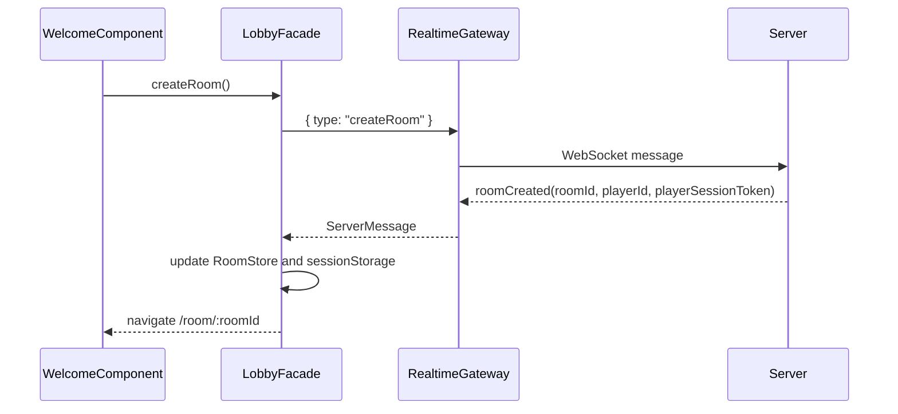

# SnakeForTwo Frontend Architecture

Status: Draft for Angular implementation  
Target client: Angular web application with Akita state management and raw WebSockets  
Backend source: `docs/architecture.md`, `SnakeForTwo.Contracts`, and current API placeholder

## 1. Goals

The frontend is responsible for the lobby, room flow, low-latency player input, local/opponent prediction, and rendering the latest authoritative server state with a deterministic animation phase.

The backend remains authoritative. The client never decides the real game result, collision state, food state, or canonical snake position. The client does predict short-term movement so controls feel immediate and remote players do not freeze between snapshots.

Primary goals:

- Provide a welcome screen with create-room and join-room flows.
- Support invite URLs that join a room directly.
- Present the room state, ready flow, countdown, active game, and post-game return to room.
- Keep all players visually synchronized to one render alpha.
- Apply local input immediately as a predicted next legal turn without violating tile movement rules.
- Predict other players as continuing in their last known direction.
- Replace predictions with authoritative server snapshots and rollback corrections without alpha reset or oscillation.
- Keep netcode, timing, and projection logic isolated and heavily unit tested.

## 2. Backend Contract Read

The backend documentation defines the intended WebSocket protocol. Current code is intentionally incomplete:

- `GET /ws` accepts and then closes with "WebSocket protocol is not implemented yet."
- `RealtimeMessages.cs` currently includes only partial DTOs:
  - `ClientInputMessage(DirectionDto Direction, long ClientTime)`
  - `RoomCreatedMessage(string RoomId, string PlayerId)`
  - `GameStartingMessage(string RoomId, long StartServerTime, int TickRate, int Seed)`
  - `AuthoritativeFrameMessage(string RoomId, long Tick, string StateHash)`
- The docs describe the fuller contract needed by the frontend:
  - client: `createRoom`, `joinRoom`, `ready`, `unready`, `input`, `leaveRoom`, `ping`
  - server: `roomCreated`, `roomJoined`, `roomState`, `gameStarting`, `gameStarted`, `turnIntentAccepted`, `authoritativeFrame`, `correction`, `gameFinished`, `error`, `pong`
  - reconnect: `resumeRoom` from the client and `roomResumed` from the server

The frontend should therefore own a strict TypeScript protocol model now, while expecting the backend DTOs to expand.

## 3. Technology Choices

- Angular with standalone components, route-level lazy loading, strict TypeScript, and `ChangeDetectionStrategy.OnPush`.
- Akita for persistent application state: connection, room, players, game session, authoritative snapshots, and pending inputs.
- RxJS for WebSocket streams, event dispatch, Akita queries, and time-sync sampling.
- Angular signals may be used at component boundaries via `toSignal`, but Akita remains the source of application state.
- Canvas 2D for the game board and snakes. The grid can look tile-based while still allowing sub-tile motion without forcing Angular DOM updates at 60 FPS.
- Vitest via Angular CLI for unit/component tests, plus Playwright for browser-level input/render tests.

Important dependency note: Akita's GitHub repository is archived as of 2025-05-01. This architecture still uses Akita because it is an explicit requirement, but the project should pin versions and avoid deep custom Akita extensions.

## 4. Application Shape

Suggested routes:

```text
/                  Welcome screen
/join?id=:roomId   Invite link entry; connects then joins room
/room/:roomId      Room screen with shareable id, invite URL, players, ready state
/game/:roomId      Active game surface; may be rendered inside the room shell
```

Suggested source layout:

```text
src/app/
  core/
    realtime/
      realtime-gateway.service.ts
      server-message-dispatcher.service.ts
      protocol.models.ts
      protocol-codecs.ts
      room-session-storage.service.ts
    clock/
      clock-sync.service.ts
      render-clock.service.ts
    state/
      connection.store.ts
      connection.query.ts
  features/
    lobby/
      welcome.component.ts
      lobby.facade.ts
    room/
      room.store.ts
      room.query.ts
      room.facade.ts
      room-shell.component.ts
      ready-panel.component.ts
    game/
      state/
        game-session.store.ts
        game-session.query.ts
        players.store.ts
        players.query.ts
        input-buffer.store.ts
        input-buffer.query.ts
      netcode/
        game-clock.ts
        input-scheduler.ts
        prediction-engine.ts
        projection-engine.ts
        correction-engine.ts
      render/
        game-board.component.ts
        canvas-game-renderer.service.ts
        snake-sprite.projector.ts
      input/
        keyboard-input.service.ts
        touch-input.service.ts
        player-input.facade.ts
  shared/
    models/
    ui/
```

Components stay thin. They call facades, display query-derived view models, and do not construct ad hoc selectors.

## 5. WebSocket Protocol Model

Use discriminated unions for every message:

```ts
export type ClientMessage =
  | { type: 'createRoom' }
  | { type: 'joinRoom'; roomId: string }
  | { type: 'resumeRoom'; roomId: string; playerSessionToken: string }
  | { type: 'ready'; roomId: string }
  | { type: 'unready'; roomId: string }
  | { type: 'leaveRoom'; roomId: string }
  | {
      type: 'input';
      roomId: string;
      direction: Direction;
      clientTime: number;
      clientSequence: number;
    }
  | { type: 'ping'; clientTime: number; sampleId: string };

export type ServerMessage =
  | RoomCreatedMessage
  | RoomJoinedMessage
  | RoomResumedMessage
  | RoomStateMessage
  | GameStartingMessage
  | GameStartedMessage
  | AuthoritativeFrameMessage
  | CorrectionMessage
  | GameFinishedMessage
  | ErrorMessage
  | PongMessage;
```

The frontend should runtime-validate inbound JSON before it mutates any store. Unknown message types are logged and ignored. Malformed known messages become connection errors.

Room session messages should include a private seat-reclaim token:

```ts
interface RoomCreatedMessage {
  type: 'roomCreated';
  roomId: string;
  playerId: string;
  playerSessionToken: string;
  room: RoomState;
}

interface RoomJoinedMessage {
  type: 'roomJoined';
  roomId: string;
  playerId: string;
  playerSessionToken: string;
  room: RoomState;
}

interface RoomResumedMessage {
  type: 'roomResumed';
  roomId: string;
  playerId: string;
  playerSessionToken: string;
  room: RoomState;
}
```

Minimum extra server fields needed for the intended frontend:

```ts
interface AuthoritativeFrameMessage {
  type: 'authoritativeFrame';
  roomId: string;
  matchId: string;
  tick: number;
  serverTime: number;
  stateHash: string;
  state: AuthoritativeGameState;
}

interface AuthoritativeGameState {
  board: { width: number; height: number };
  food: FoodItem[];
  snakes: Record<PlayerId, AuthoritativeSnake>;
  status: 'Running' | 'Finished';
}

interface FoodItem {
  ownerPlayerId: string;
  cell: Cell;
}

interface AuthoritativeSnake {
  playerId: string;
  alive: boolean;
  head: Cell;
  direction: Direction;
  body: Cell[];
}
```

The important semantic detail is that `head` and `direction` mean "where the snake moves from for this tile tick", not "the tile the snake should eventually reach". For a frame at tick `T`, `direction` is the outgoing direction used for movement from tick `T` to tick `T + 1`.

Accepted turn intents are broadcast before the resulting full frame:

```ts
interface TurnIntentAcceptedMessage {
  type: 'turnIntentAccepted';
  roomId: string;
  matchId: string;
  playerId: string;
  direction: Direction;
  effectiveTick: number;
  clientTime: number;
  clientSequence: number | null;
  serverReceivedAt: number;
}
```

`effectiveTick` has the same outgoing-direction meaning: `effectiveTick: T` means the direction applies to movement from tick `T` to tick `T + 1`.

Canonical game coordinates are math-style: `X` increases right and `Y` increases upward. Canvas rendering should invert `Y` only at the drawing boundary.

## 6. State Model With Akita

Use Akita for meaningful state transitions, not per-animation-frame data.

Stores:

- `ConnectionStore`
  - socket status, last error, reconnect status
  - server time offset, RTT, jitter, time-sync confidence
- `RoomStore`
  - room id, local player id, player session token presence, invite URL, room status
  - players, seats, display names if added later, ready flags
  - countdown metadata
- `GameSessionStore`
  - match id, board, seed, timing config, start server time
  - latest authoritative tick, latest state hash
  - snapshot ring buffer as plain objects
  - game status and result
- `PlayersStore`
  - entity store keyed by `playerId`
  - authoritative snake metadata and render color/seat
- `InputBufferStore`
  - local input order for deterministic prediction diagnostics
  - pending local inputs not yet covered by an authoritative frame or correction
  - predicted direction timeline
  - rejected/stale input diagnostics

Akita rules:

- Store plain serializable objects, not `Map`, `Set`, classes, canvas objects, or timers.
- Put selectors in queries, not components.
- Use `applyTransaction` when one server message updates multiple stores, especially `gameStarted`, `authoritativeFrame`, `correction`, and `gameFinished`.
- Keep high-frequency RAF alpha outside Akita to avoid 60 FPS global state churn.

`playerSessionToken` is a private seat-reclaim credential. Persist it in `sessionStorage` keyed by room id so a browser refresh can send `resumeRoom` and reclaim the same player id/seat. Do not put this token in the invite URL, logs, or share UI.

## 7. Time And Animation Model

The frontend uses two separate concepts:

- Authoritative state: the last server snapshot or correction accepted into stores.
- Render phase: a local monotonic clock-derived alpha shared by every rendered player.

`ClockSyncService` estimates server time:

```text
estimatedServerNow = performance.now() + serverTimeOffsetMs
```

The offset is derived from `ping`/`pong` samples and smoothed by rejecting high-jitter outliers.

`RenderClockService` runs one `requestAnimationFrame` loop outside Angular change detection. Every frame it computes:

```text
elapsedMs = estimatedServerNow - matchStartServerTime
continuousTick = elapsedMs / tickDurationMs
currentTick = floor(continuousTick)
tileAlpha = continuousTick - currentTick
```

The backend contract now defines one server tick as one tile movement. At the default 2 tiles per second, `tickDurationMs` is 500 ms.

`AnimationFramesPerTile` is visual metadata. At the default 5 frames per tile, the canonical visual frame duration is 100 ms:

```text
visualFrameDurationMs = tickDurationMs / animationFramesPerTile
visualFrameIndex = floor(tileAlpha * animationFramesPerTile)
quantizedTileAlpha = visualFrameIndex / animationFramesPerTile
```

The renderer may draw with continuous `tileAlpha` or quantize to `quantizedTileAlpha` when using frame-based sprites. Every snake uses the same alpha source. Server snapshots never reset alpha. Rollback corrections replace the authoritative base and the next RAF projects the corrected state using the same alpha.

## 8. Projection And Prediction

Rendering is a pure projection:

```text
renderedSnake = project(authoritativeBase, predictedTimeline, renderTick, tileAlpha)
```

For each player:

1. Pick the best authoritative snapshot at or before the render tick.
2. Build predicted movement from that snapshot to the render tick.
3. Use local pending inputs for the local player.
4. Use unchanged last-known direction for remote players.
5. Render the current in-tile position as:

```text
displayHead = fromCell + directionVector * tileAlpha
```

This satisfies the "server sends where to go from" rule. The next tile is derived locally from `fromCell + directionVector`, but the snapshot anchor remains the source of truth.

### Local Input

When the local player presses a direction:

1. Capture `clientTime = estimatedServerNow`.
2. Allocate a local `clientSequence` and send the input immediately over WebSocket.
3. Insert the direction into the local predicted timeline at the earliest legal future tile boundary.
4. Reject direct 180-degree turns unless they become legal through an already queued intermediate turn.
5. Replace the optimistic entry when the matching `turnIntentAccepted` acknowledgement arrives.

If the snake is between `(1,0)` and `(2,0)` moving right and the player presses up, the visible position continues toward `(2,0)`. The predicted timeline changes immediately so the next segment starts upward from `(2,0)`.

### Remote Prediction

Remote players continue in their last authoritative direction until a newer authoritative frame or `turnIntentAccepted` message says otherwise. A server-accepted turn intent is inserted into the same per-player predicted timeline as local optimistic inputs.

### Corrections

When an `authoritativeFrame` or `correction` arrives:

1. Validate and normalize the message.
2. Apply it atomically with an Akita transaction.
3. Remove local pending inputs whose target tile tick is covered by the authoritative frame or correction.
4. Rebuild the predicted timeline from the corrected authoritative tick.
5. Do not reset the render clock or alpha.

If the prediction was correct, the next projected position should be bit-for-bit or pixel-equivalent to the current position. If the prediction was wrong, the corrected authoritative state is projected at the same alpha on the next RAF.

To avoid visible jitter:

- Do not interpolate alpha from server arrival time.
- Do not apply partial store updates across multiple emissions.
- Do not blend logical state through old wrong states.
- A very short visual-only reconciliation blend is allowed, defaulting to at most one visual animation frame, for example 100 ms with the default timing. The logical snake state must already be the corrected authoritative projection while the display position eases toward it.

## 9. Room And Game Flow

Create room:



Join room:

- From welcome form: submit room id, send `joinRoom`.
- From invite URL `/join?id=abracadabra`: route resolver/facade connects WebSocket and sends `joinRoom` using the `id` query parameter unless a matching stored `playerSessionToken` exists.
- On success, `RoomStore` receives `roomJoined` and `roomState`.
- On `roomCreated` or `roomJoined`, store the returned `playerSessionToken` in `sessionStorage`.

Resume room:

- On browser refresh, app startup checks `sessionStorage` for the current room id.
- If a token exists, send `resumeRoom` with `roomId` and `playerSessionToken`.
- On `roomResumed`, restore the same local player id and seat, update the stored token, then sync from authoritative `roomState`.
- If resume fails, clear the stale token and fall back to the welcome/join flow.

Ready/start:

- Ready button sends `ready`.
- The button is disabled while awaiting server confirmation.
- `roomState` is authoritative for ready flags.
- `gameStarting` starts countdown using `startServerTime`, not local receipt time.
- `gameStarted` initializes game stores and moves the UI into game mode.

Game finish/rematch:

- `gameFinished` records result and final state.
- The room returns to ready state when the server emits `roomState` or a post-game room message.
- Ready flags reset server-side; the client mirrors server state.

## 10. Rendering Architecture

`GameBoardComponent` owns the canvas element and delegates all drawing to `CanvasGameRenderer`.

Rendering loop:

```text
requestAnimationFrame
  read latest game snapshot synchronously from GameSessionQuery
  read latest input prediction synchronously from InputBufferQuery
  compute render tick and alpha from RenderClockService
  project all snakes with ProjectionEngine
  draw board, food, snakes, overlays
```

The canvas renderer runs outside Angular. Angular change detection is used for lobby, room UI, countdown text, errors, and result overlays.

For the first version:

- Draw tile grid as canvas lines or alternating tile fills.
- Draw snake bodies as rounded rectangles or simple sprite rectangles.
- Use `devicePixelRatio` scaling so sprites stay sharp.
- Keep board aspect ratio stable and responsive.
- Keyboard input uses arrow keys/WASD. Touch controls can be added with a directional pad or swipe service.

## 11. TDD Strategy

Start with pure tests before components.

Netcode unit tests:

- `RenderClockService` computes the same alpha for all players.
- Alpha advances on local monotonic time and does not reset when a snapshot arrives.
- Tile alpha is based on one server tick per tile.
- Quantized animation alpha is derived from configurable `AnimationFramesPerTile`.
- `ProjectionEngine` renders `(0,0)` moving right at alpha `0.4` as `(0.4,0)`.
- `ProjectionEngine` renders the same authoritative anchor moving up at alpha `0.4` as `(0,0.4)`.
- Canvas coordinate projection inverts canonical `Y` so positive game `Y` renders upward on screen.
- Local input while between tiles schedules the turn at the next tile boundary.
- Direct 180-degree input is rejected unless queued through an intermediate legal turn.
- Remote prediction continues the last authoritative direction.
- Correct prediction plus authoritative frame causes no projected position change.
- Incorrect prediction plus correction uses the same alpha and corrected direction on the next frame, with only the allowed short visual-only blend.
- Snapshot ring buffer chooses the nearest authoritative base at or before the render tick.
- Local pending inputs covered by an authoritative tick are removed without requiring server acknowledgement sequences.

Akita store/query tests:

- `roomCreated` sets room id, local player id, player session token presence, invite URL, and player list.
- `roomJoined` and `roomState` are idempotent and authoritative.
- `roomResumed` restores the same local player id and seat.
- Ready button state is derived from room state, not optimistic UI alone.
- `gameStarting` stores countdown based on server time.
- `gameStarted` clears stale snapshots and pending post-game UI.
- `authoritativeFrame` updates session, snakes, board, player-owned food, and covered local inputs in one transaction.
- `correction` replaces rollback-affected snapshots and rebuilds predictions.
- `gameFinished` returns the UI to room/rematch mode.

WebSocket service tests:

- Sends `createRoom`, `joinRoom`, `resumeRoom`, `ready`, `unready`, `leaveRoom`, `input`, and `ping` with the correct payload.
- Rejects malformed inbound JSON.
- Ignores unknown message types with diagnostics.
- Preserves outbound input ordering.
- Reconnect behavior reclaims the same seat and does not duplicate pending inputs.

Component tests:

- Welcome screen creates a room and navigates after `roomCreated`.
- Welcome screen joins by typed room id.
- Invite route auto-joins the room id from the `/join?id=...` URL.
- Room route auto-resumes when a matching `playerSessionToken` is present after refresh.
- Room screen shows room id, invite URL, players, and ready flags.
- Ready button disables while awaiting acknowledgement and re-enables on error.
- Countdown displays server-time-derived remaining time.

Browser/render tests:

- Canvas is nonblank at desktop and mobile sizes.
- Keyboard input produces an immediate pending local prediction.
- A rollback correction changes direction without resetting alpha.
- Sprites remain inside the board and scale with device pixel ratio.

## 12. Implementation Sequence

1. Define frontend protocol models and runtime validators.
2. Build pure netcode utilities with tests: clock, input scheduling, projection, correction handling.
3. Build Akita stores and queries with tests.
4. Build `RealtimeGateway` with a mocked WebSocket test harness.
5. Build welcome and invite join flow.
6. Build room UI and ready/countdown flow.
7. Build game canvas renderer against fake snapshots.
8. Connect real WebSocket messages once backend protocol is implemented.
9. Add Playwright smoke tests for room flow and rendering.

## 13. Confirmed Decisions And Open Questions

Confirmed frontend decisions:

1. One server tick equals one tile movement.
2. Default movement speed is 2 tiles per second.
3. Default visual animation is 5 frames per tile, configurable independently from server simulation.
4. `authoritativeFrame` should use an object-oriented board payload with board size, snakes, food, alive state, server time, status, and state hash.
5. `authoritativeFrame` does not need acknowledged input sequences in the first contract.
6. A very short visual-only correction blend is allowed, while logical state updates immediately to the authoritative projection.
7. Canonical game coordinates use math-style `Y` upward.
8. Invite URLs use `/join?id={roomId}` with a short, about 12-symbol room code.
9. Browser refresh should reclaim the same player id and seat via a private server-issued `playerSessionToken`.
10. Food belongs to a specific player and should be represented as owned food items in authoritative state.

No open architecture questions are currently tracked here. Detailed game-engine rules and detailed animation behavior are intentionally deferred to later design prompts.

## 14. References

- Backend architecture: `docs/architecture.md`
- Backend contract placeholder: `src/SnakeForTwo.Contracts/RealtimeMessages.cs`
- Angular testing docs: https://angular.dev/guide/testing
- Angular RxJS/signals interop: https://angular.dev/ecosystem/rxjs-interop
- Akita store docs: https://opensource.salesforce.com/akita/docs/store/
- Akita entity store docs: https://opensource.salesforce.com/akita/docs/entities/entity-store/
- Akita transactions docs: https://opensource.salesforce.com/akita/docs/transactions/
- Akita best practices: https://opensource.salesforce.com/akita/docs/best-practices/
- Akita repository archive notice: https://github.com/salesforce/akita
